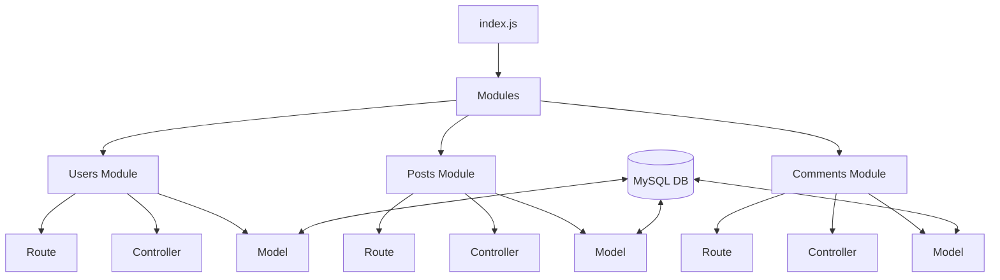

# 📱 Simple Facebook API (Sequelize Edition)

[](https://nodejs.org/)
[](https://expressjs.com/)
[](https://sequelize.org/)
[](https://www.mysql.com/)

A robust, modular Backend API for a social media platform, built with **Node.js**, **Express**, and **Sequelize ORM**. This project implements core functionalities like user authentication, post management, and a hierarchical commenting system with full relational integrity.

---

## 🚀 Key Features

-   **🔐 User Authentication & Security**
    -   Secure registration with `bcrypt` password hashing.
    -   Unique email validation.
    -   Login authentication system.
-   **📝 Post Management (CRUD)**
    -   Create, Read, Update, and Delete posts.
    -   Authorship tracking via Sequelize associations.
-   **💬 Commenting System**
    -   Interactive comments on specific posts.
    -   Full CRUD lifecycle for comments.
-   **📊 Relational Database Design**
    -   **One-to-Many**: Users to Posts.
    -   **One-to-Many**: Posts to Comments.
    -   **One-to-Many**: Users to Comments.
-   **🔄 Advanced Querying**
    -   Eager loading using `include` to fetch users with their respective posts and comments in a single request.
    -   Database synchronization via Sequelize.

---

## 🛠️ Tech Stack

-   **Backend**: [Node.js](https://nodejs.org/) & [Express.js](https://expressjs.com/)
-   **ORM**: [Sequelize](https://sequelize.org/) (Version 6)
-   **Database**: [MySQL](https://www.mysql.com/) (Hosted on Clever Cloud)
-   **Security**: [Bcrypt](https://www.npmjs.com/package/bcrypt) for password encryption.

---

## 📐 Architecture

The project follows a **Modular Design Pattern**, ensuring scalability and a clean separation of concerns.



---

## 🌐 API Endpoints

### 👤 Users
| Method | Endpoint | Description |
| :--- | :--- | :--- |
| `POST` | `/addUser` | Register a new user |
| `POST` | `/userLogin` | Login user |
| `GET` | `/getUser` | Get all users with their posts & comments |

### 📄 Posts
| Method | Endpoint | Description |
| :--- | :--- | :--- |
| `GET` | `/getPosts` | Fetch all posts with author and comments |
| `POST` | `/addPost` | Create a new post |
| `PATCH` | `/updatePost/:id` | Update post details (Title/Content) |
| `DELETE` | `/deletePost/:id` | Remove a post from the database |

### 💬 Comments
| Method | Endpoint | Description |
| :--- | :--- | :--- |
| `GET` | `/getComments` | Fetch all comments |
| `POST` | `/addComments` | Add a comment to a post |
| `PATCH` | `/updateComments/:id`| Update a specific comment |
| `DELETE` | `/deleteComments/:id`| Delete a specific comment |

---

## ⚙️ Setup & Installation

Follow these steps to get the project running locally:

1.  **Clone the repository:**
    ```bash
    git clone https://github.com/Abdelrahman2656/Simple-FaceBook.git
    cd Simple-FaceBook
    ```

2.  **Install dependencies:**
    ```bash
    npm install
    ```

3.  **Database Configuration:**
    The project is pre-configured to connect to a **Clever Cloud MySQL** instance. No local DB setup is required unless you want to use your own. To change the DB, update `Database/dbconnection.js`.

4.  **Run the application:**
    ```bash
    npm start
    ```
    The server will start on `http://localhost:3000`.

---

## 📂 Project Structure

```bash
📦 Simple-FaceBook
 ┣ 📂 Database
 ┃ ┗ 📜 dbconnection.js   # Sequelize connection
 ┣ 📂 modules
 ┃ ┣ 📂 Users             # User routes, controllers, models
 ┃ ┣ 📂 Posts             # Post routes, controllers, models
 ┃ ┗ 📂 Comments          # Comment routes, controllers, models
 ┣ 📜 index.js            # Main entry point
 ┣ 📜 package.json        # Dependencies & scripts
 ┗ 📜 vercel.json         # Vercel deployment config
```

---

## 👨‍💻 Author

**Abdelrahman**
-   GitHub: [@Abdelrahman2656](https://github.com/Abdelrahman2656)
-   Project: Simple-FaceBook

---

*Made with ❤️ and Node.js*
